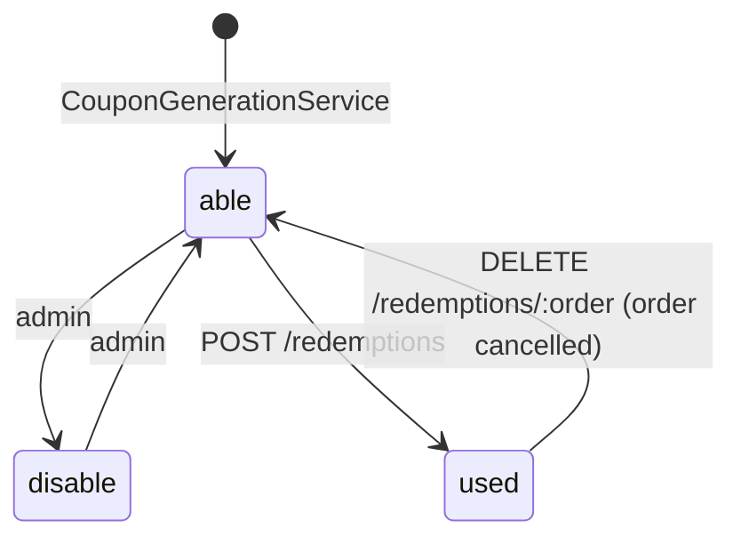
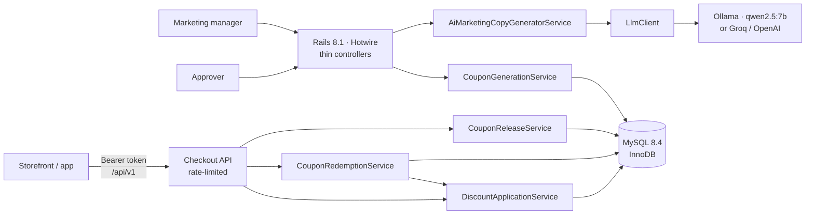

# Promotion System

[](https://github.com/LucasR2D2S/promotion-system/actions/workflows/ci.yml)

**A campaign and coupon engine for e-commerce, with an AI copywriter that drafts the launch e-mail.**

Marketing teams create discount campaigns, a second person approves them, unique coupon codes are generated in bulk, a JSON checkout API quotes discounts and redeems each coupon exactly once (a cancelled order releases it), and a local LLM writes the e-mail that announces the campaign. Every generated e-mail is checked against the campaign's business rules before a human sees it.

`Ruby 3.4` · `Rails 8.1` · `MySQL 8.4 LTS` · `Hotwire (Turbo + importmap)` · `RSpec (176 examples)` · `Docker` · `Ollama / OpenAI-compatible LLMs`

> The UI is in Brazilian Portuguese because the target market is Brazil. Code, tests and docs are in English.

---

## Table of contents

- [The problem](#the-problem)
- [What it does](#what-it-does)
- [AI Marketing Feature](#-ai-marketing-feature)
- [Checkout API](#checkout-api)
- [Architecture](#architecture)
- [Data layer: MySQL and concurrency](#data-layer-mysql-and-concurrency)
- [Testing strategy](#testing-strategy)
- [Getting started (Docker)](#getting-started-docker)
- [Production image](#production-image)
- [Configuration](#configuration)
- [Engineering log](#engineering-log)
- [Roadmap and known limitations](#roadmap-and-known-limitations)

---

## The problem

Discount campaigns sit close to revenue. Small mistakes cost money directly:

| Risk | What goes wrong | How this system handles it |
|---|---|---|
| **Coupon guessing** | Sequential codes (`BLACKFRIDAY-0001`, `-0002`, …) can be enumerated by anyone | Random, non-sequential codes such as `BLACKFRIDAY30-7KQ2-M9XA`, using an alphabet without look-alike characters (no `0/O`, `1/I`) |
| **Unreviewed discounts** | One person can publish a 90% discount by mistake | Approval by a **different** user is required before any coupon gives a discount |
| **Rounding and precision errors** | Float math and truncated columns change prices | BigDecimal end to end, half-up rounding to cents, `DECIMAL(5,2)` rates |
| **Double generation** | Two admins clicking at the same time double the coupon supply | Row lock on the campaign; generation only tops up what is missing, so running it twice is safe |
| **Double spending** | Two checkouts use the same coupon at the same instant | Row lock on the coupon plus a unique index on its redemption; idempotent retries; one coupon per order |
| **Slow campaign launches** | Every campaign needs e-mail copy, written by hand | An AI copywriter drafts it in seconds, guarded by the campaign's rules |

## What it does

| Flow | Who | Business rules |
|---|---|---|
| Create a campaign (name, % discount, dates, product categories) | Marketing manager | Discount between 0.01% and 100%; unique campaign code, case-insensitive (`black10` = `BLACK10`) |
| Approve a campaign | Approver | The approver must be a different person from the creator |
| Generate coupons in bulk | Marketing manager | Random unique codes, batched inserts, row lock, top-up only |
| Enable or disable a coupon | Marketing manager | A **used** coupon is final and cannot be re-enabled |
| Quote a discount for a cart | Checkout (API) | Coupon enabled, not used, campaign approved and not expired (valid through 23:59:59 of its last day); discount rounded half-up to cents; the total never goes below zero |
| Redeem a coupon for an order | Checkout (API) | Same rules as the quote, checked **under a row lock**; each coupon pays for exactly one order; one coupon per order; a retry of the same order returns the original redemption |
| Cancel an order | Checkout (API) | Releases the coupon for another order; the redemption is kept, marked cancelled (financial record); a cancelled order can't use a coupon again; cancelling twice is a no-op |
| Delete a campaign | Marketing manager | Blocked once any of its coupons was used in an order, even a cancelled one (redemptions are financial records) |
| Draft the campaign e-mail with AI | Marketing manager | See [AI Marketing Feature](#-ai-marketing-feature) |

Coupon lifecycle:



---

## 🤖 AI Marketing Feature

On any campaign page, **"Gerar e-mail marketing com IA"** ("Generate marketing e-mail with AI") produces a ready-to-review e-mail: subject, preheader, body and call-to-action button.

**Output from the default model (`qwen2.5:7b`), shown verbatim**, for a 30% Black Friday campaign on Electronics, Games and Home:

```text
Subject:   Black Friday: Desconto de 30% em Eletrônicos, Games e Casa!
Preheader: Confira ofertas imperdíveis até 29/11/2026 na Promotion Store.
Button:    Acesse a Promotion Store

Estamos prontos para a Black Friday! A Promotion Store oferece desconto de 30% em toda a
nossa seleção de produtos. Você pode aproveitar esta oportunidade nas categorias: Eletrônicos,
Jogos e Games, Casa e Decoração. Não perca tempo! Use o cupom {{CUPOM}} no carrinho para
aproveitar o desconto. Válido até 29/11/2026. Corra agora!
```

It passed every automatic rule: exact discount, one coupon tag, real expiration date, no placeholders. A human reviewer would still fix "toda a nossa seleção" (it implies a store-wide sale) and the made-up "Jogos e Games" category, which is exactly why the AI drafts and a person approves ([limitations](#roadmap-and-known-limitations)).

`{{CUPOM}}` is a merge tag (`{{NOME}}`, the customer's first name, is also supported). At send time each customer receives **their own unique coupon** from the bulk generator, which turns a generic e-mail into trackable, per-customer offers.

### Product decisions

- **The AI drafts and a human decides.** Nothing is sent automatically; the page asks for review before sending. The AI speeds up the marketing team, and accountability for what customers read stays with a person.
- **Local model by default (Ollama).** Campaign data never leaves the company's machines, each generation costs nothing, and the demo runs without an API key. Switching to Groq or OpenAI is configuration, not code: all three expose the same Chat Completions API.
- **The model was chosen by measurement.** `bin/rails ai:benchmark` runs candidate models on the same campaigns:

  | Model | Passed validation | Model calls / e-mail | Avg latency | Flagged for human review |
  |---|---|---|---|---|
  | `llama3.2` (3B) | 12/12 | 1.33 | 3.4 s | 2 (vague "we have everything you need") |
  | **`qwen2.5:7b`** (default) | 11/12 | 2.0 | 5.9 s | **0** |

  llama3.2 passes the automatic checks more often, but it fails in ways no rule can catch: grammar mistakes, invented dates, generic text. qwen2.5:7b fails on things the validation catches and corrects. For copy that reaches customers, text quality was worth about 2.5 s more per e-mail. Latency depends on hardware; these numbers come from the author's machine. The "flagged" column comes from keyword heuristics ("toda a loja", "frete", …) and misses paraphrases like "toda a nossa seleção" in the sample above. It helps compare models, but it does not replace a human review.

### Engineering: LLM output is untrusted input

A language model is a probabilistic dependency, so the service treats its output as untrusted user input:

1. **Structured output.** The model must answer in a strict JSON Schema (`subject`, `preheader`, `body`, `call_to_action`).
2. **Business-rule validation.** Every draft is checked for:
   - the `{{CUPOM}}` merge tag exactly once;
   - the **exact** discount ("30%", never "up to 30%": a fixed discount advertised as "up to" is misleading under Brazilian consumer law, CDC art. 37);
   - no unfilled placeholders (`[Store name]`, `{valid_until}`) and no HTML;
   - no invented urgency or scarcity ("limited time", "while supplies last");
   - Portuguese only, no corrupted characters.
3. **Self-correction loop.** A rejected draft goes back to the model with the list of problems, up to 3 attempts. If it still fails, the user gets a friendly error and never sees the bad draft.
4. **Defensive parsing.** Invalid UTF-8 bytes from the model are scrubbed and rejected instead of crashing the request, and escaped or dangling line breaks are normalized.
5. **No sales copy for expired campaigns.** The service refuses before calling the model.
6. **Observability.** Every attempt emits an `attempt.ai_marketing_copy` event with the problems found. It is a hook for metrics such as rejection rate per model and per rule, and it is what the benchmark uses.

Everything that fails is mapped to an actionable message. For example, a model that was never downloaded shows *"No Ollama, baixe-o com `ollama pull qwen2.5:7b`"* ("In Ollama, download it with `ollama pull qwen2.5:7b`") instead of a generic error.

### API key security

- **Never in code or git.** The key comes from `AI_API_KEY` (the environment: a git- and docker-ignored `.env` locally, the platform's secret manager in production) or from Rails encrypted credentials. `.env.example` documents the variables without secrets.
- **Server-side only.** The key is never sent to the browser, never logged, and error messages carry HTTP status codes, never provider response bodies. A spec asserts that a 401 does not leak the key.
- **Not needed at all with Ollama.** No `Authorization` header is sent when no key is configured.

---

## Checkout API

A JSON API for storefronts and apps (`/api/v1`). Every request carries a bearer token issued per client. The **order reference is the idempotency key**: a checkout can retry any call after a timeout without double-charging a coupon. (Coupon codes are random; to try the example below, copy one from a campaign page.)

| Endpoint | Purpose | Success |
|---|---|---|
| `POST /api/v1/quotes` | Discount for a cart, without consuming the coupon | `200` |
| `POST /api/v1/redemptions` | Redeem a coupon for an order | `201`, or `200` + `Idempotent-Replayed: true` on a retry |
| `GET /api/v1/redemptions/:order_reference` | Coupon status of an order | `200` |
| `DELETE /api/v1/redemptions/:order_reference` | Order cancelled: release the coupon | `200` (idempotent) |

```bash
curl -X POST http://localhost:3000/api/v1/redemptions \
  -H "Authorization: Bearer psk_dev_local_only" -H "Content-Type: application/json" \
  -d '{"coupon_code": "CYBER25-CHTA-433H", "cart_total": "399.90", "order_reference": "PED-1042"}'
```

```json
{
  "order_reference": "PED-1042",
  "coupon_code": "CYBER25-CHTA-433H",
  "status": "active",
  "original_total": "399.90",
  "discount_amount": "99.98",
  "final_total": "299.92",
  "currency": "BRL",
  "redeemed_at": "2026-09-24T14:08:10Z",
  "cancelled_at": null,
  "cancellation_reason": null
}
```

Design decisions:

- **Money as strings** (`"299.92"`) with fixed separators: JSON numbers become floats in most clients, and the app's pt-BR locale would otherwise format `"1.500,00"`. A smoke test against the running app caught exactly that bug before release.
- **Stable error contract.** Clients branch on `error.code`; `error.message` is for display (pt-BR):

  | HTTP | `error.code` |
  |---|---|
  | 400 | `invalid_json` |
  | 401 | `unauthorized` (missing, unknown or revoked token) |
  | 404 | `coupon_not_found`, `order_not_found` |
  | 409 | `order_already_has_coupon`, `order_cancelled`, `coupon_busy` (with `Retry-After: 1`) |
  | 422 | `coupon_used`, `coupon_disabled`, `promotion_expired`, `promotion_not_approved`, `invalid_cart_total`, `invalid_order_reference` |
  | 429 | `rate_limited` |

- **Tokens stored as SHA-256 digests**, shown once at creation (`bin/rails api:clients:create NAME="Loja virtual"`, plus `list` and `revoke`). A database leak doesn't leak working credentials. The tokens are random, so an unsalted digest is safe and can be looked up directly (bcrypt's salted hashes can't).
- **Rate limit per client** (Rails 8 `rate_limit`, default 120/min): quotes reveal whether a code exists, so without a limit they could be used to enumerate coupon codes.
- In development the seeds create a client with the token `psk_dev_local_only`.

## Architecture



**Business logic lives in service objects, not in controllers.** Controllers only handle HTTP (params in, redirect, render or JSON out), which is why the checkout API was a thin layer over services that already existed and were already tested.

```
app/services/
├── application_service.rb               # Service.call(...) convention
├── service_result.rb                    # success?/value/error (Ruby 3.2 Data)
├── coupon_generation_service.rb         # bulk, unique, locked, idempotent
├── discount_application_service.rb      # read-only BigDecimal quote
├── coupon_redemption_service.rb         # locked, idempotent, exactly-once use
├── coupon_release_service.rb            # order cancelled: release the coupon
├── ai_marketing_copy_generator_service.rb
└── llm_client.rb                        # any OpenAI-compatible API
lib/
├── ai_copy_benchmark.rb                 # model comparison harness
└── tasks/ai.rake                        # bin/rails ai:benchmark
```

**Expected business failures are values, not exceptions.** An expired coupon or a campaign with nothing left to generate returns `ServiceResult.failure(:promotion_expired)`. The caller branches on `success?` and maps the error code to an i18n message or an HTTP status. Exceptions are kept for the truly unexpected.

---

## Data layer: MySQL and concurrency

Coupons are a contention hotspot: many requests touch the same campaign at the same moment during a Black Friday. The database is configured for that workload ([`config/database.yml`](config/database.yml)):

| Setting | Why |
|---|---|
| `transaction_isolation: READ-COMMITTED` | Avoids InnoDB gap locks, the main source of deadlocks under the default `REPEATABLE READ` when many transactions insert or lock rows of the same campaign |
| `innodb_lock_wait_timeout: 5` | A contended row fails fast and can be retried, instead of holding a Puma thread for MySQL's default 50 s |
| `sql_mode: TRADITIONAL` + `strict` | Invalid data raises instead of being silently truncated, which is non-negotiable for money |
| `utf8mb4` + `utf8mb4_0900_ai_ci` | Full Unicode, and case-insensitive code lookup (`black10` finds `BLACK10`) |
| Pool = Puma threads + 2 | One connection per thread, with headroom |

Guarantees that live in the schema and the code rather than in configuration:

- **A `UNIQUE` index on `coupons.code`** is the final guard against duplicate codes. Bulk inserts (`insert_all`, one statement per 1,000 rows) let MySQL skip collisions, and the service regenerates them.
- **A row lock on the campaign** (`with_lock`) serializes coupon generation per campaign. Measured: **4 concurrent threads** asked for the same 2,000 coupons, and exactly **2,000** were created in 475 ms. One thread did the work; the others got `:nothing_to_generate`.
- **Coupon redemption locks only the coupon row** (`SELECT … FOR UPDATE`) and re-checks every rule *after* the lock is held. Checking first and writing later is the window through which one coupon would pay for two orders. The campaign row is never locked, so a Black Friday's coupons are redeemed in parallel (a spec proves that a lock on one coupon doesn't delay another). If the row stays busy past the lock timeout, the checkout gets a retryable `:coupon_busy`.
- **Two independent guards against double spending, verified by removing each one** against real MySQL threads racing to redeem the same coupon:

  | Row lock | Unique index (one *active* redemption per coupon) | Result |
  |---|---|---|
  | ✅ | ✅ | exactly one redemption (shipped) |
  | ❌ | ✅ | still exactly one: the index rejects the second insert |
  | ✅ | ❌ | still exactly one: the lock serializes the checkouts |
  | ❌ | ❌ | **the same coupon paid for several orders in 3 out of 3 runs** |

- **A partial unique index, emulated.** Cancelling an order must free the coupon while keeping the redemption row (it is a financial record). The rule is "unique among *active* redemptions", but MySQL has no partial indexes (`UNIQUE … WHERE cancelled_at IS NULL`). A stored generated column, `active_coupon_id = IF(cancelled_at IS NULL, coupon_id, NULL)`, carries a `UNIQUE` index; MySQL allows many `NULL`s, so cancelled rows don't count. The guarantee stays in the database: a spec inserts a second active redemption directly and gets `RecordNotUnique`. The double-spend experiments above were re-run against this index with the same results.
- **Release uses the same lock order as redemption** (the coupon row first), so a cancellation and a new redemption of the same coupon are serialized and can't deadlock. Two simultaneous cancellations of the same order: one does the work, the other gets the idempotent reply.
- **Idempotent redemption.** Checkouts retry on timeouts. The same coupon and order returns the original redemption (`replayed: true`, original amounts) instead of a false "coupon already used" for an order that went through.
- **Foreign keys are enforced**, with `dependent: :destroy` where it applies. Migrating off SQLite exposed deletes that would have failed in production.
- **`DECIMAL(5,2)` discount rates.** The original column was `DECIMAL(10,0)`, which silently stored **12.5% as 12%**. A regression spec keeps it fixed.
- **Single-query checkout lookup.** The coupon, its campaign and the approval are loaded with one `JOIN` (`eager_load`); a spec asserts exactly one query.

---

## Testing strategy

**176 examples, 0 failures**, running in about 17 s against a real MySQL database.

| Layer | Examples | Highlights |
|---|---|---|
| Services | 96 | Discount math, coupon generation, redemption and release (including real multi-threaded races), AI copy validation, HTTP client contract |
| Requests (API) | 17 | Auth, status codes and error contract, idempotent replays, cancellation, rate limit |
| Features (Capybara) | 39 | End-to-end admin flows, including AI generation with a stubbed LLM |
| Models | 20 | Validations, associations, cascading deletes under enforced foreign keys, protection of redeemed coupons, API token digests |
| Tooling | 4 | The benchmark harness itself |

What makes the suite trustworthy, beyond the count:

- **Table-driven money cases** for the rounding edges: 12.49875 → 12.50, 0.005 → 0.01, a 100% discount, a zero total.
- **A property-based check**: 200 random totals and rates must keep the money invariants (discount + final = total, whole cents, within half a cent of the exact value).
- **Time-boundary tests** with `travel_to`: a coupon is valid at 23:59:59 on its last day and expired at 00:00 the next day.
- **Mutation-checked.** Six typical bugs were injected into the discount service one at a time (a missing expiry check, off-by-one dates, Float math, rounding down, a wrong total, an N+1 query). Every one turns the suite red. The first run exposed a test that asserted nothing, and it was fixed.
- **Real concurrency, not simulated.** The redemption races run outside the test transaction, with one connection and one transaction per thread, all released at the same instant. Removing both the lock and the unique index makes them fail (see the table in [Data layer](#data-layer-mysql-and-concurrency)).
- **No real network in tests.** WebMock blocks all HTTP, so AI specs never bill an API or flake on the network.
- **Factories** (`factory_bot`) with intent-revealing traits: `:approved`, `:expired`, `:used`, `:disabled`.

**Continuous integration** ([`.github/workflows/ci.yml`](.github/workflows/ci.yml)) runs on every push and pull request:

| Job | What it checks |
|---|---|
| Tests | The full suite against a MySQL 8.4 service container, with the app eager-loaded (`CI=true`) and `zeitwerk:check`, so autoloading errors that would only surface in production fail the build |
| Security | Brakeman (static analysis for Rails vulnerabilities; the build fails on any warning) and bundler-audit (gems with known CVEs) |
| Production image | Builds the production image, boots it with MySQL and smoke-tests it (`/up`, login page, non-root user), so a broken Dockerfile never reaches `main` |

Dependabot opens weekly PRs for outdated gems and actions, and CI validates each one.

---

## Getting started (Docker)

**Prerequisites:** Docker Desktop. For the AI feature, [Ollama](https://ollama.com) running on the host with the model downloaded:

```bash
ollama pull qwen2.5:7b          # 4.7 GB; lighter but weaker: llama3.2 (2 GB)
```

**Run it:**

```bash
cp .env.example .env            # optional: override defaults, add an API key
docker compose up --build       # MySQL + Rails on http://localhost:3000
```

On first boot the entrypoint creates the database, runs the migrations and loads demo data: 5 campaigns (Black Friday, Cyber Monday, Christmas, Consumer Day, Back to School) and 50 coupons covering every state (active, used, disabled, expired campaign, awaiting approval). Every used coupon comes with the order that redeemed it.

| Login | Password | Role |
|---|---|---|
| `gerente@promotion.dev` | `senha123` | Marketing manager |
| `aprovador@promotion.dev` | `senha123` | Approver |

The checkout API is available with `Authorization: Bearer psk_dev_local_only` (see [Checkout API](#checkout-api)).

**Everyday commands:**

```bash
# Test suite (the first run creates the test database)
docker compose run --rm -e RAILS_ENV=test web sh -c "bin/rails db:prepare && bundle exec rspec"

# Rails console
docker compose exec web bin/rails console

# Reload demo data (idempotent: safe to run again)
docker compose exec web bin/rails db:seed

# Compare LLMs on the copywriting task
docker compose exec web bin/rails ai:benchmark MODELS=llama3.2,qwen2.5:7b N=12

# Issue a checkout API token for a storefront (shown once)
docker compose exec web bin/rails api:clients:create NAME="Loja virtual"

# Health check (for load balancers and uptime monitors)
curl http://localhost:3000/up

# Stop (add -v to also delete the MySQL data)
docker compose down
```

MySQL is exposed on host port **3307**, so it doesn't clash with a local MySQL on 3306.

> **Linux hosts:** Ollama listens on `127.0.0.1` by default. For the container to reach it through `host.docker.internal`, you may need to start Ollama with `OLLAMA_HOST=0.0.0.0`. Docker Desktop on Windows and macOS works out of the box.

## Production image

The same `Dockerfile` has a multi-stage production target, and it is the default when a platform runs a plain `docker build`:

| | Development image | Production image |
|---|---|---|
| Size | 727 MB | **368 MB** |
| Compilers (`gcc`, headers) | yes | no: gems are built in a separate `build` stage |
| Dev/test gems | yes | no (`BUNDLE_WITHOUT=development:test`) |
| Assets | compiled on demand | precompiled, digest-stamped, served with a 1-year cache |
| User | root | `rails` (uid 1000) |
| Health | none | Docker `HEALTHCHECK` on `/up` |

On boot, the entrypoint runs `db:prepare` (creates the schema or applies pending migrations); demo seeds are skipped outside development. Logs go to STDOUT with request IDs, which is what any platform collects.

**Run it locally** (plain http on port 8080, with its own database):

```bash
echo "SECRET_KEY_BASE=$(openssl rand -hex 64)" >> .env
docker compose -f docker-compose.prod.yml up --build -d --wait
open http://localhost:8080            # sign up at /users/sign_up
docker compose -f docker-compose.prod.yml exec web bin/rails api:clients:create NAME="Loja"
docker compose -f docker-compose.prod.yml down        # -v also deletes its data
```

**Ready to deploy** to any Docker platform (Railway, Fly.io, Kamal on a VPS, ECS…):

- set `SECRET_KEY_BASE`, the `DB_*` variables (or `DATABASE_URL`) and `RAILS_HOSTS`;
- terminate TLS at the platform or proxy: HTTPS is forced by default (`RAILS_FORCE_SSL`), with `/up` exempt so health checks work over plain http;
- for the AI feature, point `AI_BASE_URL`, `AI_MODEL` and `AI_API_KEY` to a hosted OpenAI-compatible provider (Groq has a free tier), since Ollama isn't usually available in production. It is a configuration change, not a code change.

## Configuration

All settings come from environment variables (12-factor). The defaults work locally without a `.env`.

| Variable | Default | Purpose |
|---|---|---|
| `AI_BASE_URL` | `http://host.docker.internal:11434/v1` | Any OpenAI-compatible endpoint (Ollama, Groq, OpenAI) |
| `AI_MODEL` | `qwen2.5:7b` | Model ID for that endpoint |
| `AI_API_KEY` | *(empty)* | Needed only for hosted providers; secret |
| `AI_TIMEOUT` | `60` | Seconds to wait for the model |
| `STORE_NAME` | `Promotion Store` | Brand used in the AI copy signature |
| `DB_HOST`, `DB_PORT`, `DB_USERNAME`, `DB_PASSWORD`, `DB_NAME` | set by compose | MySQL connection |
| `DB_LOCK_WAIT_TIMEOUT` | `5` | InnoDB lock wait, in seconds |
| `RAILS_MAX_THREADS` | `3` | Puma threads; the DB pool follows it |
| `API_RATE_LIMIT_PER_MINUTE` | `120` | Checkout API requests per client per minute |
| `SECRET_KEY_BASE` | *(required in production)* | Signs sessions and cookies; secret |
| `RAILS_HOSTS` | *(any)* | Comma-separated public hostnames (DNS-rebinding protection) |
| `RAILS_FORCE_SSL`, `RAILS_ASSUME_SSL` | `true` | Set to `false` only for a local plain-http production stack |
| `RAILS_LOG_LEVEL` | `info` | Production log level |

---

## Engineering log

This project started as a Rails 6.1 / Ruby 2.7 / SQLite app with a failing test suite. The modernization was done in reviewable steps:

1. **SQLite → MySQL + Docker.** The switch surfaced bugs that SQLite had hidden: foreign keys that were never enforced, a typo'd index, a truncated decimal column, and case-insensitive code uniqueness.
2. **Green baseline before upgrading.** Fixed the pre-existing failures first (a broken controller constant, a search that never matched partial names), so the upgrade had a trustworthy safety net.
3. **Ruby 2.7 → 3.4, Rails 6.1 → 8.1.** Both old versions were end-of-life. Webpacker, Turbolinks and Node were replaced by importmap, Turbo and Propshaft. Config was regenerated from a fresh Rails 8.1 app, `link_to method:` became real forms (`button_to`), and Devise was configured for Turbo (422/303).
4. **Service objects** for coupon generation and discount quoting, with concurrency measured, not assumed.
5. **Exactly-once coupon redemption** with a row lock, idempotent retries and a financial record per order, verified by removing each guard.
6. **Checkout API and order cancellation.** JSON endpoints over the existing services, and cancellation that frees the coupon while keeping the record, enforced by an emulated partial unique index.
7. **Business-oriented seeds** that are deterministic and idempotent, only run in development, and whose dates stay valid over time.
8. **An AI copywriter** with guardrails, a benchmark-driven model choice, and secret handling.
9. **CI and a production image**: tests, security scans and a smoke-tested multi-stage image on every push.

## Roadmap and known limitations

- **Per-client audit trail.** Redemptions don't record which API client created them yet; recording it would allow restricting reads and cancellations to the client that owns the order.
- **OpenAPI description** of the checkout API, to generate client SDKs and docs.
- **Asynchronous AI generation.** Generation currently runs inside the request (about 6 s locally). With slower providers it belongs in a background job, with the result streamed back through Turbo Streams.
- **Semantic checks for AI copy.** Rule-based validation catches format and policy violations, not every hallucination (for example, implying a store-wide sale when only some categories are discounted). Options: an LLM-as-judge pass, or checking the categories mentioned against the campaign data.
- **Public deploy.** The production image is built and smoke-tested in CI but not deployed anywhere yet. The next step is choosing a platform with managed MySQL (Railway, or Kamal on a VPS) and adding a deploy job after CI passes.
- **Encrypted credentials.** The repository's original `credentials.yml.enc` has no matching `master.key`, so secrets come from the environment. Regenerate it with `bin/rails credentials:edit` to use Rails credentials.
